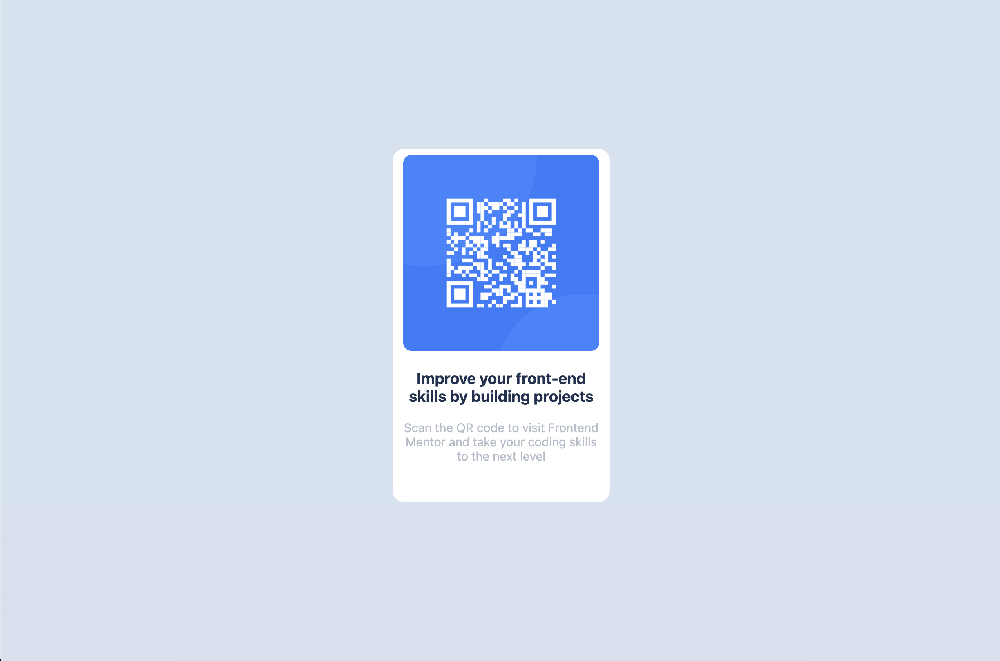

# Frontend Mentor - QR code component solution

This is a solution to the [QR code component challenge on Frontend Mentor](https://www.frontendmentor.io/challenges/qr-code-component-iux_sIO_H). Frontend Mentor challenges help you improve your coding skills by building realistic projects. 

## Table of contents

- [Overview](#overview)
  - [Screenshot](#screenshot)
- [My process](#my-process)
  - [Built with](#built-with)
  - [What I learned](#what-i-learned)
- [Author](#author)

## Overview

### Screenshot

## My process

### Built with

- Semantic HTML5 markup
- CSS custom properties

### What I learned

Working on this project, I learned that sometimes, you just have to approach problems with a basic understanding and not overthink things. I also learned that CSS custom properties can be very useful for styling components.

### Continued development

I want to focus more on building responsive designs and improving my web dev skills in general. I'm also working on becoming a professional full-stack developer/software engineer. 

## Author

- Website - [Abdul Hafiz Isahak](https://github.com/ahisahak)
- Frontend Mentor - [@ahisahak](https://www.frontendmentor.io/profile/ahisahak)

## Acknowledgments

Thank you, Frontend Mentor, for providing this hands-on challenge.
